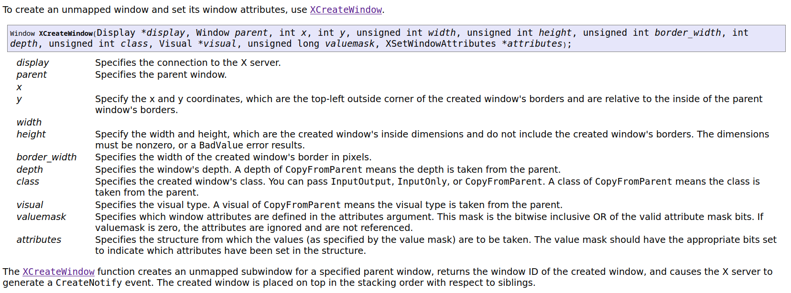
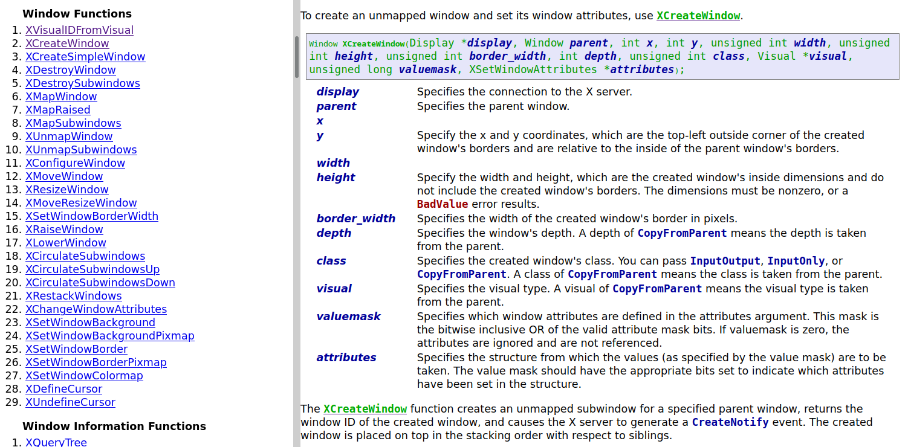

# Xlib - C Language X Interface

This is a edited mirror of the
[Xlib documentation](https://www.x.org/releases/current/doc/libX11/libX11/libX11.html).

Read online at:
- [codeberg](https://nvlled.codeberg.page/xlib-doc)
- [github](https://nvlled.github.io/xlib-doc/)

_Note: github pages loads faster since it uses Content-Encoding to transfer only 500kb instead of 5MB_

## Changes
- added simple syntax highlighting and other color styles
- change default font size and max page width
- added sidebar for easier navigation
- search forms
- clickable cross-references

## Original

## After edit

